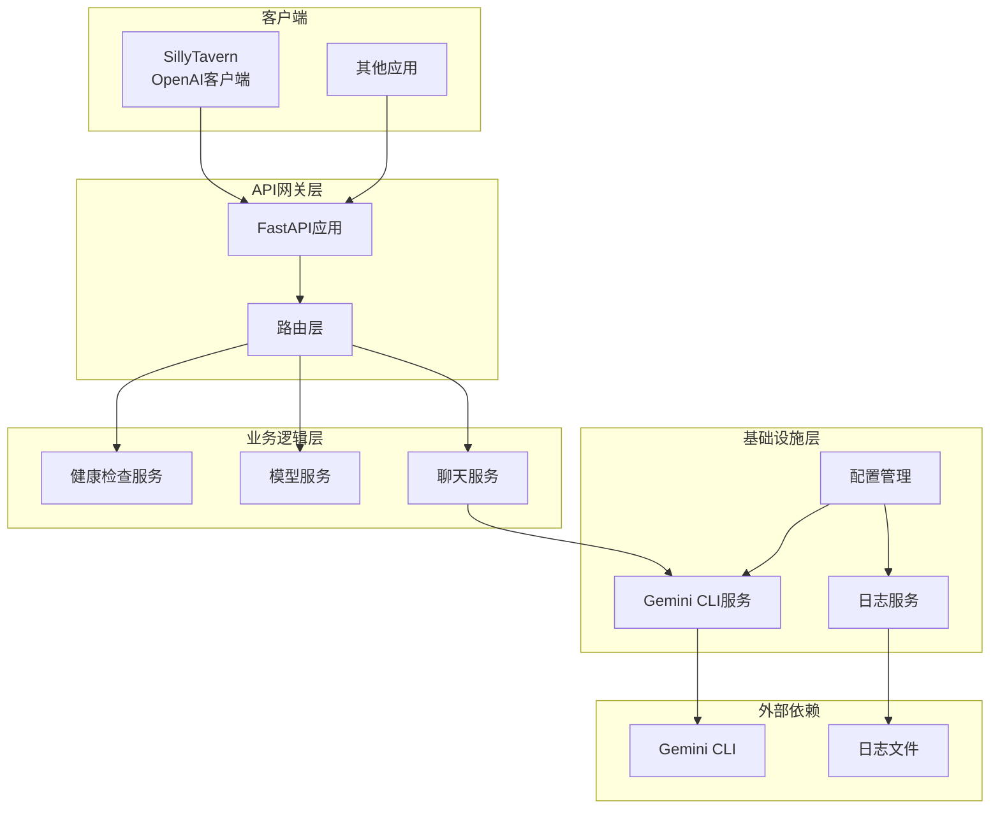
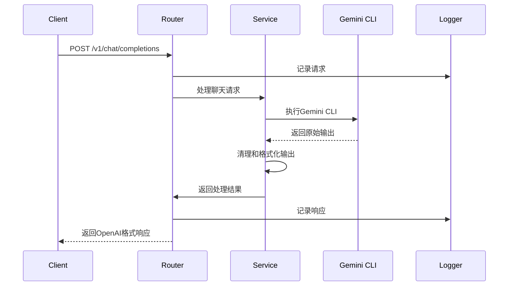
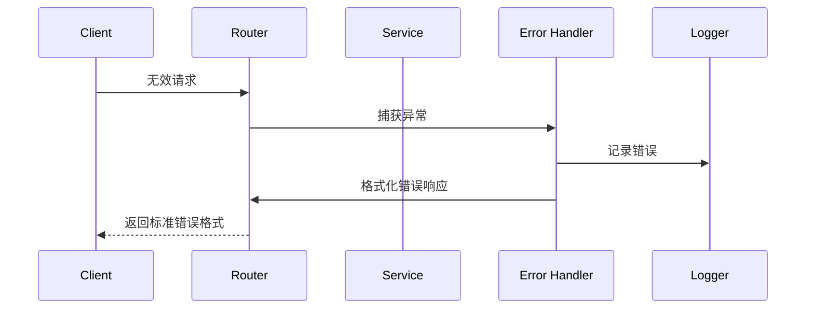

# Gemini Proxy 项目架构设计

## 🏗️ 系统架构概览



## 📁 详细模块设计

### 1. 应用入口 (`src/gemini_proxy/main.py`)
```python
# 主要职责：
# - 创建FastAPI应用实例
# - 配置中间件
# - 注册路由
# - 启动应用
```

### 2. 配置管理 (`src/gemini_proxy/config.py`)
```python
# 主要职责：
# - 管理所有配置项
# - 支持环境变量和配置文件
# - 提供类型安全的配置访问
```

### 3. 数据模型 (`src/gemini_proxy/models.py`)
```python
# 主要职责：
# - 定义Pydantic数据模型
# - 请求/响应数据结构
# - 数据验证规则
```

### 4. 路由层 (`src/gemini_proxy/routes/`)
#### 4.1 健康检查 (`health.py`)
```python
# 端点：GET /health
# 功能：服务健康状态检查
```

#### 4.2 模型列表 (`models.py`)
```python
# 端点：GET /v1/models, GET /models
# 功能：返回支持的模型列表
```

#### 4.3 聊天补全 (`chat.py`)
```python
# 端点：POST /v1/chat/completions, POST /chat/completions
# 功能：处理聊天请求，支持流式和非流式
```

### 5. 服务层 (`src/gemini_proxy/services/`)
#### 5.1 Gemini服务 (`gemini_service.py`)
```python
# 主要职责：
# - 执行Gemini CLI命令
# - 处理多种参数格式
# - 超时和错误处理
# - 输出清理和格式化
```

#### 5.2 日志服务 (`logging_service.py`)
```python
# 主要职责：
# - 请求/响应日志记录
# - 日志轮转管理
# - 结构化日志输出
```

### 6. 工具类 (`src/gemini_proxy/utils/`)
#### 6.1 响应工具 (`response_utils.py`)
```python
# 主要职责：
# - 构建OpenAI兼容响应
# - 流式响应处理
# - 错误响应格式化
```

#### 6.2 验证工具 (`validation.py`)
```python
# 主要职责：
# - 输入数据验证
# - 参数校验
# - 业务规则验证
```

## 🔄 数据流设计

### 请求处理流程


### 错误处理流程


## 🎯 设计原则

### 1. 单一职责原则
- 每个模块只负责一个明确的功能
- 避免功能交叉和重复

### 2. 依赖倒置原则
- 高层模块不依赖低层模块
- 通过接口进行抽象

### 3. 开闭原则
- 对扩展开放，对修改关闭
- 通过配置和插件支持新功能

### 4. 接口隔离原则
- 客户端不应该依赖它不需要的接口
- 保持接口简洁和专注

## 🔧 配置设计

### 环境变量配置
```python
# 必需配置
GEMINI_PATH: str = "/opt/homebrew/bin/gemini"

# 可选配置
LOG_LEVEL: str = "INFO"
LOG_FILE: str = "proxy.log"
MAX_LOG_SIZE: int = 5 * 1024 * 1024  # 5MB
LOG_BACKUP_COUNT: int = 5
REQUEST_TIMEOUT: float = 60.0
HOST: str = "127.0.0.1"
PORT: int = 7777
```

### 配置优先级
1. 环境变量（最高优先级）
2. 配置文件
3. 默认值（最低优先级）

## 📊 性能考虑

### 1. 并发处理
- 使用异步处理提高并发能力
- 避免阻塞操作
- 合理设置超时时间

### 2. 资源管理
- 合理设置日志轮转
- 监控内存使用
- 避免资源泄漏

### 3. 扩展性
- 模块化设计便于扩展
- 配置驱动便于调整
- 插件架构支持新功能

## 🔒 安全考虑

### 1. 输入验证
- 所有输入数据验证
- 防止注入攻击
- 参数边界检查

### 2. 输出清理
- 清理Gemini CLI输出
- 防止XSS攻击
- 敏感信息过滤

### 3. 访问控制
- CORS配置
- 可选的认证机制
- 速率限制支持

---

*本架构设计将指导项目的重构实施，确保系统具有良好的可维护性、可扩展性和稳定性。*